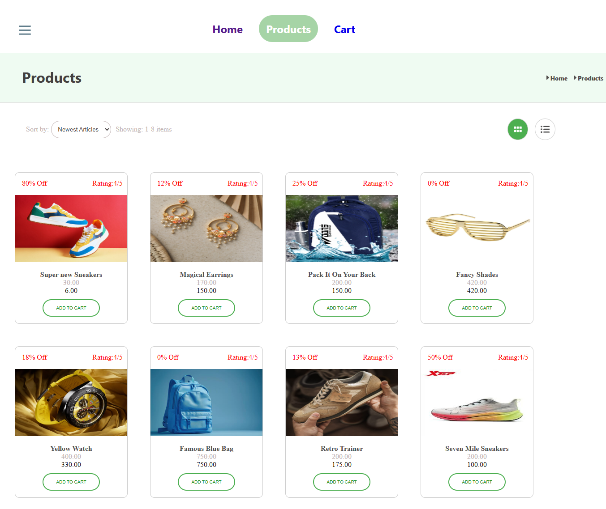
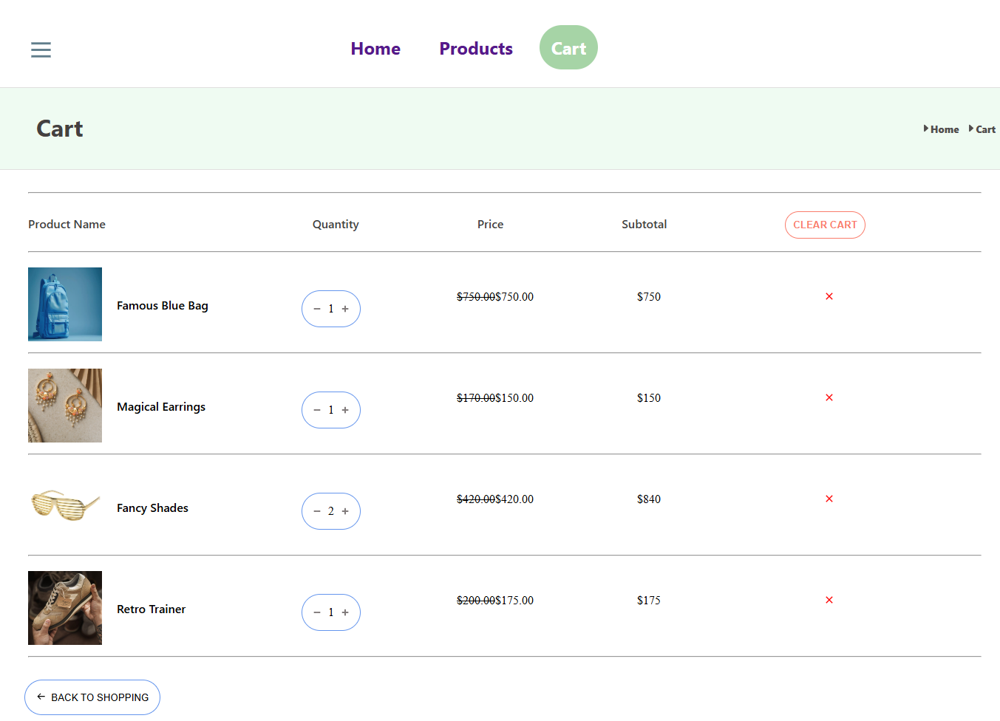

# E-Commerce App

A modern, e-commerce web application built with React. This project demonstrates a simple online store with product listings, cart functionality, and a clean UI.

## Showcase

Below are some screenshots and highlights of the app in action. This section demonstrates the user experience, design, and main features of the e-commerce app.

<!-- Add your screenshots below. Example: -->




### What you'll see:
- A visually appealing homepage with featured products
- Interactive product catalog with add-to-cart functionality
- A responsive cart summary and checkout flow
- Smooth navigation and transitions

---

## Features
- Product catalog with images and details
- Add/remove items to cart
- View cart summary
- Responsive design
- Simple navigation menu
- Image slider for featured products

## Technologies Used
- React
- CSS

## Getting Started

### Prerequisites
- Node.js (v14)
- npm or yarn

### Installation
1. Clone the repository:
	```sh
	git clone https://github.com/hrushikesh1999/e-commerce-app.git
	cd e-commerce-app
	```
2. Install dependencies:
	```sh
	npm install
	```

3. Run:
	```sh
	npm start
	```

### Running Locally
To start the development server:
```sh
npm start
```
The app will be available at `http://localhost:3000`.

## Project Structure
```
public/           # Static files and assets
src/              # Source code
  components/     # Reusable UI components
	 cart/         # Cart-related components
	 products/     # Product-related components
	 slide_info/   # Image slider components
Dockerfile        # Docker configuration
package.json      # Project metadata and scripts
```
## Running Locally with Docker

Build the image:

```bash
docker build -t e-commerce-app .
```
Run the container (for local development):
```bash
docker run -it -p 3000:3000 -v %cd%:/app -v /app/node_modules e-commerce-app
```

## License
This project is licensed under the MIT License.

## Author
- Hrushikesh ([@hrushikesh1999](https://github.com/hrushikesh1999))
